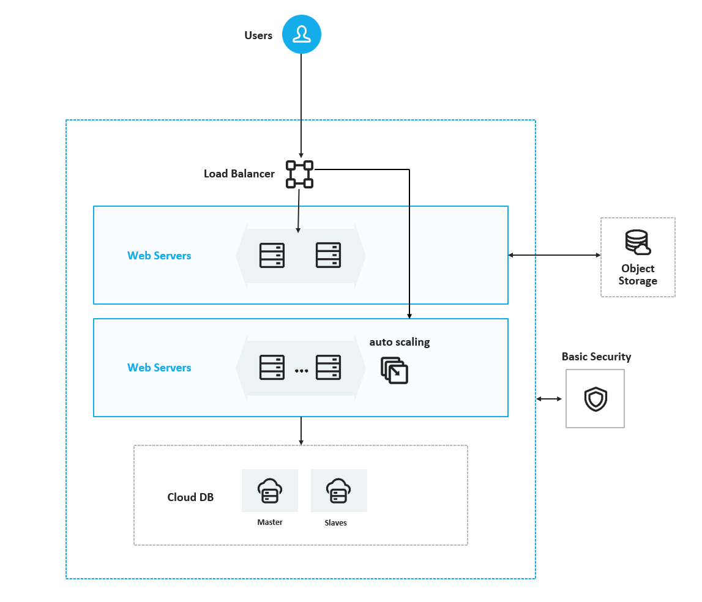

# festi! 인프라 구축 프로젝트

## 시연 영상


Naver Cloud Platform 기반으로 구축한 축제/공연 커뮤니티 웹 서비스입니다.  
웹 애플리케이션은 Apache + PHP로 동작하고, 데이터는 Cloud DB for MySQL에 저장됩니다. 사용자는 Public Application Load Balancer를 통해 접속하며, 웹 서버는 사설 네트워크로 DB와 통신합니다.

## 1. 프로젝트 목표

- 공인 주소로 접속 가능한 PHP 웹 서비스 구축
- 게시글, 댓글, 좋아요, 관심 축제, 방문 상태 등 사용자 기능 구현
- 공공데이터포털 TourAPI 기반 축제/공연 데이터 연동
- Object Storage를 활용한 이미지 업로드 구조 구성
- Load Balancer와 Auto Scaling을 활용한 확장 가능한 웹 서버 구조 설계
- Cloud DB for MySQL을 private subnet에 배치하여 DB 직접 노출 방지

## 2. 주요 기능

| 기능 | 설명 |
|---|---|
| 축제/공연 목록 | 공공데이터 API로 수집한 축제 데이터를 웹에서 조회 |
| 축제 상세 | 상세 정보, 댓글, 좋아요, 관심 있어요, 다녀왔어요 상태 관리 |
| 커뮤니티 게시판 | 글 작성, 조회, 수정, 삭제 |
| 댓글/대댓글 | 게시글 및 축제 상세에서 댓글 작성 |
| 이미지 업로드 | 게시글 이미지를 Object Storage에 저장하고 DB에는 URL 저장 |
| 로그인 | 사용자별 댓글, 좋아요, 관심 축제 기록 관리 |
| 마이페이지 | 사용자가 누른 좋아요, 관심 축제, 작성 글/댓글 확인 |

## 3. 인프라 구조



```text
Users
  |
  | HTTP 80
  v
Public Application Load Balancer
  - <public-application-load-balancer>
  - Listener: HTTP 80
  - Target Group: <web-target-group>
  - Health Check: /health.php
  |
  | HTTP 80
  v
Web Servers
  - web-01
  - web-02
  - Auto Scaling Group 생성 서버
  - Apache + PHP
  |
  | MySQL 3306
  v
Cloud DB for MySQL
  - <cloud-db-instance>
  - <private-db-subnet>
  - public domain 미사용

Object Storage
  - 게시글 이미지 저장
  - MySQL에는 image_url만 저장
```

## 4. NCP 리소스 구성

| 구분 | 이름/값 | 설명 |
|---|---|---|
| VPC | `<vpc-name>`, 10.10.0.0/16 | 프로젝트 전용 네트워크 |
| Public LB Subnet | 10.10.1.0/24 | Public Load Balancer 배치 |
| Public Web Subnet | 10.10.4.0/24 | web-01, web-02 배치 |
| Private Web Subnet | 10.10.2.0/24 | Auto Scaling 서버 배치 실습 |
| Private DB Subnet | 10.10.3.0/24 | Cloud DB for MySQL 배치 |
| Load Balancer | `<public-application-load-balancer>` | 외부 접속 단일 진입점 |
| Target Group | `<web-target-group>` | web 서버 health check 및 라우팅 |
| Cloud DB | `<cloud-db-instance>` | MySQL 8.4.8 |
| Object Storage | `<object-storage-bucket>` | 업로드 이미지 저장 |

공개 문서에는 실제 DB 도메인, DB 사용자명, Load Balancer 주소, Object Storage 버킷명을 남기지 않고 역할 기반 placeholder로 정리했습니다. 실제 값은 서버 내부 설정 파일과 NCP 콘솔에서만 관리합니다.

## 5. Apache와 Nginx 구성 방향

현재 웹 애플리케이션은 Apache + PHP 조합으로 구성했습니다. PHP 페이지를 빠르게 배포하고 `libapache2-mod-php`로 MySQL 연동 기능을 확인하기 쉬워 프로젝트 초기 구축에 적합했습니다.

Nginx는 이번 구현의 필수 구성 요소로 사용하지 않았지만, 실제 운영에서는 정적 파일 처리와 리버스 프록시 역할로 확장할 수 있습니다. 예를 들어 Nginx를 앞단에 두고 정적 리소스와 캐시를 처리한 뒤, PHP 요청만 Apache 또는 PHP-FPM으로 전달하는 구조를 적용할 수 있습니다.

이번 프로젝트에서는 외부 진입점과 트래픽 분산은 NCP Application Load Balancer가 담당하고, 웹 서버 내부 실행은 Apache가 담당하는 방식으로 역할을 나눴습니다.

## 6. 보안 설계

- 사용자는 Load Balancer로만 웹 서비스에 접근합니다.
- Cloud DB는 private subnet에 배치하고 public domain을 사용하지 않습니다.
- 웹 서버에서 Cloud DB로 TCP 3306만 허용합니다.
- SSH 22번 포트는 관리자 IP만 허용합니다.
- DB 접속 정보와 Object Storage 인증키는 GitHub에 올리지 않습니다.
- GitHub에는 `config/*.masked.php` 또는 예시 설정만 포함합니다.

## 7. 검증 결과

### Apache/PHP 확인

```bash
apache2 -v
php -v
curl -I http://localhost/
curl http://localhost/health.php
```

### Cloud DB 연결 확인

```bash
export DB_HOST="<cloud-db-private-domain>"
export DB_NAME="<database_name>"
export DB_USER="<db_user>"

php -r 'require "/var/www/html/config/db.php"; echo "PDO OK\n";'
nc -vz "$DB_HOST" 3306
mysql -h "$DB_HOST" -u "$DB_USER" -p "$DB_NAME"
```

### Load Balancer Health Check

```text
Target Group: <web-target-group>
Health Check URL: /health.php
Expected:
- web-01: UP / HTTP 200
- web-02: UP / HTTP 200
- Auto Scaling 서버: UP / HTTP 200 확인
```

### 부하 테스트

```bash
export LB_URL="http://<public-lb-domain>"
ab -n 1000 -c 50 "$LB_URL/"
```

확인한 결과:

```text
Complete requests: 1000
Failed requests: 0
Requests per second: 168.69
```

## 8. Auto Scaling 설계

Auto Scaling은 웹 서버 수를 부하 상황에 따라 늘릴 수 있도록 구성했습니다.

| 항목 | 값 |
|---|---|
| Launch Configuration | `<launch-configuration>` |
| Server Image | `<web-server-image>` |
| Auto Scaling Group | `<auto-scaling-group>` |
| 최소/기대/최대 용량 | 1 / 1 / 2 |
| Health Check | Load Balancer |
| Scale Out | 서버 1대 추가 |
| Scale In | 서버 1대 반납 |
| Cooldown | 300초 |

실제 운영에서는 GitHub 또는 배포 스크립트를 사용해 새로 생성되는 서버에도 동일한 소스를 배포하는 구조로 확장할 수 있습니다.

## 9. AI 활용 기록 요약

본 프로젝트에서는 AI를 단순 코드 생성 용도로만 사용하지 않고, 오류 해결과 기능 개선 과정에 반복적으로 활용했습니다.

- Apache 500 오류 원인 분석
- PHP `require_once` 경로 오류 해결
- Cloud DB 접속 권한 오류 해결
- MySQL DDL 권한 문제 해결
- Object Storage 이미지 업로드 오류 해결
- Load Balancer Health Check 문제 해결
- Auto Scaling 서버와 Target Group 연결 구조 검토
- UI 개선 및 사용자 기능 반복 개선

자세한 기록은 [docs/ai-usage-record.md](docs/ai-usage-record.md)를 참고합니다.

## 10. 디렉터리 구조

```text
.
├── README.md
├── docs/
│   ├── architecture.md
│   ├── deployment-guide.md
│   ├── ai-usage-record.md
│   └── troubleshooting.md
├── sql/
│   └── schema.sql
├── scripts/
│   └── verify-server.sh
└── .gitignore
```

## 11. 앞으로의 과제

- HTTPS 적용: NCP Certificate Manager에 SSL 인증서를 등록하고, Public Load Balancer에 HTTPS 443 리스너를 추가해 사용자 접속 구간을 암호화합니다.
- HTTP 요청 리다이렉트: 기존 HTTP 80 요청은 HTTPS 443으로 전환되도록 설정해 보안 접속을 기본값으로 만듭니다.
- 배포 자동화: GitHub에 반영된 소스가 Auto Scaling으로 새로 생성되는 웹 서버에도 동일하게 배포되도록 스크립트 또는 CI/CD 구조를 보완합니다.
- 읽기 부하 분산: Cloud DB 고가용성 구성 이후 조회 트래픽을 Slave DB로 분리하는 구조를 검토합니다.


